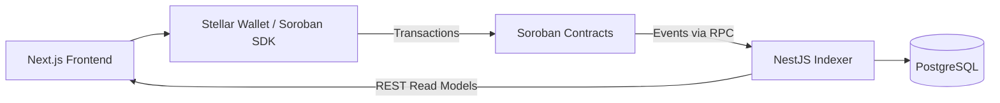

# DeWordle

[](https://github.com/Eyanus/DeWordle/actions/workflows/ci.yml)
[](https://github.com/Eyanus/DeWordle/actions/workflows/coverage.yml)
[](./LICENSE)
[](https://stellar.org/soroban)

DeWordle is an open-source word game platform migrating to a Soroban-native architecture in the Stellar ecosystem.

## Table of Contents

* [Overview](#overview)
* [Architecture](#architecture)
* [Gameplay](#gameplay)
* [Quick Start](#quick-start)
* [Docker Compose](#docker-compose)
* [Validation](#validation)
* [Repository Layout](#repository-layout)
* [Documentation](#documentation)
* [License](#license)

## Overview

DeWordle is being migrated from a traditional backend-driven architecture toward a Soroban-native design on Stellar.

The current repository contains:

* A Next.js frontend with Stellar wallet integration.
* A NestJS backend providing indexer and read-model infrastructure.
* A Soroban Rust workspace containing the migration-target contracts.
* A TypeScript Soroban SDK consumed by the frontend.
* PostgreSQL-backed projections generated from indexed Soroban events.
* Legacy Cairo contracts retained under `onchain/` for reference.

## Architecture

The migration architecture separates on-chain game state and transactions from backend indexing and frontend read models.



### Main components

| Component         | Role                                                                     |
| ----------------- | ------------------------------------------------------------------------ |
| `frontend/`       | Next.js application, wallet integration, and user-facing game experience |
| `backend/`        | NestJS API and Soroban event indexer                                     |
| `soroban/`        | Rust Soroban workspace and migration-target contracts                    |
| `soroban/sdk/ts/` | TypeScript SDK used by the frontend                                      |
| `onchain/`        | Legacy Cairo contracts retained for reference                            |
| PostgreSQL        | Stores indexed projections and backend read models                       |
| Stellar / Soroban | Hosts the migration-target smart contracts                               |

For the detailed migration architecture, see [Soroban Foundation Architecture](./docs/SOROBAN_FOUNDATION_ARCHITECTURE.md).

## Gameplay

The repository includes automated gameplay coverage for the core win flow.

The end-to-end test opens the game, enters the target word, submits the guess, and verifies that the win dialog is displayed.

> **Gameplay screenshot:** Add a real screenshot or GIF from the running application here before closing the README issue.

Once the asset is added, use:

```md

```

## Quick Start

### Frontend

Install the frontend dependencies:

```bash
npm ci --prefix frontend
```

Start the Next.js development server:

```bash
npm run dev --prefix frontend
```

The development server runs at `http://localhost:3000`.

### Backend

Install the backend dependencies:

```bash
npm ci --prefix backend
```

Start the NestJS development server:

```bash
npm run start:dev --prefix backend
```

### Soroban

Run the Soroban workspace check:

```bash
npm run soroban:check
```

## Docker Compose

The repository includes a root `docker-compose.yml` for the local PostgreSQL, Redis, backend, frontend, and Soroban RPC services.

The intended one-line startup command is:

```bash
docker compose up --build
```

Before using it, configure the required environment files for the Compose services. The current Compose configuration references `backend/Dockerfile.dev` and `backend/.env.local`; these files are not present in the current repository checkout and should be reconciled before treating the Compose stack as a clean-checkout quickstart.

## Validation

Run the maintained frontend validation suite:

```bash
npm run verify:frontend
```

Run the maintained backend validation suite:

```bash
npm run verify:backend
```

Validate the Soroban workspace:

```bash
npm run soroban:check
```

## Repository Layout

```text
.
├── backend/       # NestJS API and indexer
├── frontend/      # Next.js application
├── soroban/       # Soroban Rust workspace
├── onchain/       # Legacy Cairo contracts
├── shared/        # Shared project code
├── infra/         # Infrastructure configuration
├── docs/          # Architecture, development, and contributor documentation
├── e2e/           # End-to-end tests
├── scripts/       # Repository automation and development utilities
├── docker-compose.yml
├── LICENSE
└── package.json
```

## Documentation

* **[Repository Surface Map](./docs/REPO_SURFACE_MAP.md)** — identifies maintained, transitional, and legacy code paths.
* [Soroban Foundation Architecture](./docs/SOROBAN_FOUNDATION_ARCHITECTURE.md)
* [Soroban Local Development](./docs/SOROBAN_LOCAL_DEV.md)
* [Frontend Wallet Foundation](./docs/FRONTEND_WALLET_FOUNDATION.md)
* [Backend Indexer Foundation](./docs/BACKEND_INDEXER_FOUNDATION.md)
* [Environment Configuration](./docs/ENVIRONMENT.md)
* [Wave Issue Candidates](./docs/WAVE_MIGRATION_ISSUE_CANDIDATES.md)
* [Wave 5 Execution Plan](./docs/wave/WAVE5_EXECUTION_PLAN.md)
* [Wave 5 Phases](./docs/wave/WAVE5_PHASES.md)
* [Wave 5 Issue Tracks](./docs/wave/WAVE5_ISSUE_TRACKS.md)

## License

DeWordle is released under the [MIT License](./LICENSE).
