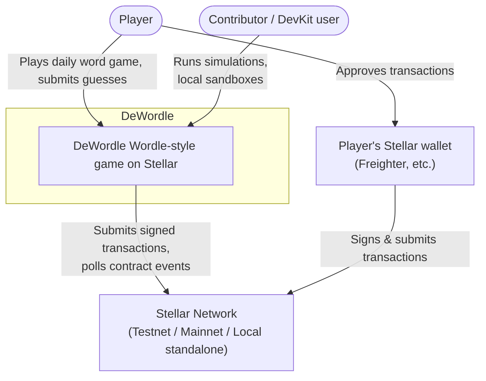
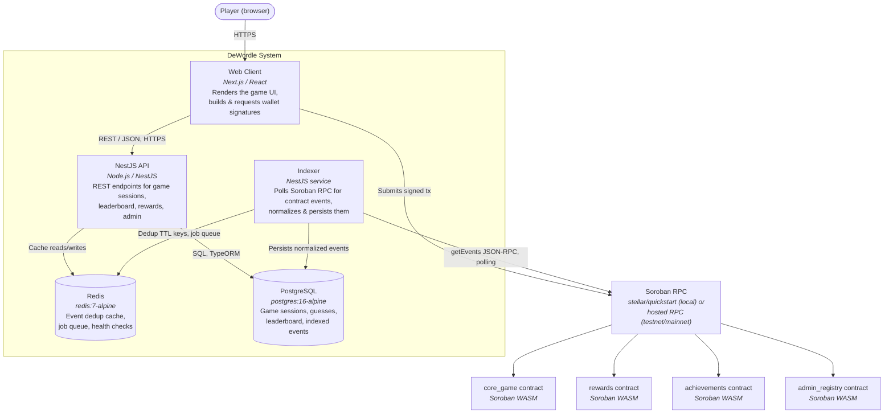

# C4 Model: System Context & Container Architecture

> Resolves #1180

High-level architecture of DeWordle using the [C4 model](https://c4model.com/)'s
System Context and Container levels, rendered as Mermaid diagrams. For the
detailed request-level flow through these containers, see
`docs/architecture/sequence-diagrams.md` (landing in a separate PR).

## Level 1: System Context

Who uses DeWordle, and what external systems does it depend on?

## Level 2: Container Diagram

The containers that make up the DeWordle system and how they communicate.

<!-- markdownlint-disable MD013 -->

### Container responsibilities & protocols

<!-- markdownlint-disable MD060 -->

| Container | Responsibility | Talks to | Protocol |
| --- | --- | --- | --- |
| **Web Client** (Next.js) | Renders the game UI; builds transactions and requests wallet signatures; calls the API for session/leaderboard data. | API, Player's wallet, Soroban RPC (for tx submission) | HTTPS/REST (API); wallet extension API; Soroban RPC JSON-RPC |
| **NestJS API** | Serves REST endpoints for game sessions, guesses, leaderboard, rewards, and admin operations. | PostgreSQL, Redis | SQL (TypeORM); Redis protocol |
| **Indexer** | Polls Soroban RPC for `core_game`/`rewards`/`achievements`/`admin_registry` contract events on an interval, validates/normalizes them, and persists them with cursor-based resumption (see `backend/src/indexer/indexer.service.ts`). | Soroban RPC, PostgreSQL, Redis | JSON-RPC (`getEvents`); SQL; Redis protocol |
| **Redis** | Event deduplication TTL cache (`EventDedupService`) so redelivered RPC events aren't double-processed; job queue backing store; liveness/health checks. | — | Redis protocol |
| **PostgreSQL** | System of record for game sessions, guess history, leaderboard standings, and indexed on-chain events/cursors. | — | SQL |
| **Soroban RPC** | Stellar's RPC surface for submitting transactions and querying contract events/ledger state. Local dev runs `stellar/quickstart` in Docker (`dewordle-soroban-rpc`); testnet/mainnet use a hosted RPC endpoint. | Soroban smart contracts | JSON-RPC over HTTP |
| **Soroban contracts** (`core_game`, `rewards`, `achievements`, `admin_registry`) | On-chain game logic: session lifecycle, guess validation, points accrual, achievement unlocks, and role/contract registry management. | — | Soroban WASM execution |

<!-- markdownlint-enable MD013 MD060 -->

## Notes

- Communication from the Indexer to Soroban RPC is **pull-based polling**,
  not a subscription/push — see `docs/architecture/sequence-diagrams.md`
  (landing in a separate PR) for the full poll-cycle sequence.
- Local development runs all of these containers via `docker-compose.yml`
  (`db`, `redis`, `soroban-rpc`, plus the `backend`/`frontend` app
  containers); see [`docs/SOROBAN_LOCAL_DEV.md`](../SOROBAN_LOCAL_DEV.md)
  for setup, and `docs/troubleshooting/soroban-rpc-guide.md` (landing in
  a separate PR) for troubleshooting.
