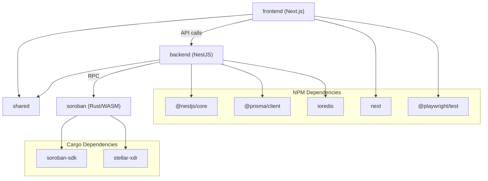

# DeWordle Dependency Graph

> Auto-generated by `scripts/gen_dependency_graph.js`. Do not edit manually.

```mermaid
graph TD
    frontend["frontend (Next.js)"]
    backend["backend (NestJS)"]
    soroban["soroban (Rust/WASM)"]
    shared["shared"]

    frontend --> shared
    backend --> shared
    frontend -->|"API calls"| backend
    backend -->|"RPC"| soroban

    subgraph npm_deps["NPM Dependencies"]
        next["next"]
        nestjs["@nestjs/core"]
        prisma["@prisma/client"]
        redis["ioredis"]
        playwright["@playwright/test"]
    end

    subgraph cargo_deps["Cargo Dependencies"]
        soroban_sdk["soroban-sdk"]
        stellar_xdr["stellar-xdr"]
    end

    frontend --> next
    backend --> nestjs
    backend --> prisma
    backend --> redis
    frontend --> playwright
    soroban --> soroban_sdk
    soroban --> stellar_xdr
```