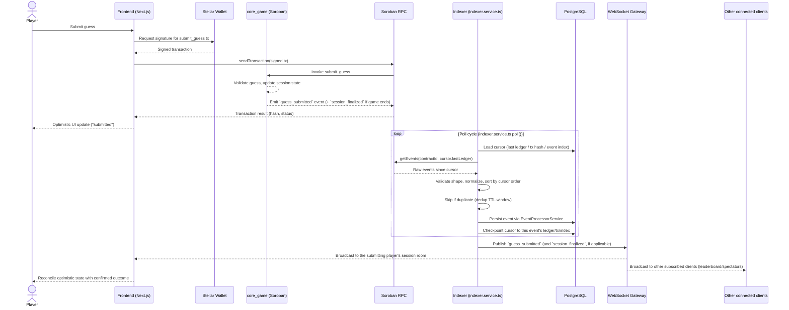

# Architecture Sequence Diagrams

> Resolves #1163

End-to-end data flow diagrams for DeWordle, rendered as GitHub-flavored
Mermaid sequence diagrams. These complement the narrative walkthrough in
[`docs/FRONTEND_DATA_FLOW_WALKTHROUGH.md`](../FRONTEND_DATA_FLOW_WALKTHROUGH.md)
and the event payload contracts in
[`docs/WEBSOCKET_EVENTS.md`](../WEBSOCKET_EVENTS.md).

## Game guess submission flow

Covers the full round trip from a player submitting a guess in the browser
to the on-chain event being reflected back in the UI: contract invocation,
event emission, RPC polling by the indexer, database persistence, and the
WebSocket broadcast that updates other connected clients (e.g. a live
leaderboard or spectator view).

### Notes

- **RPC polling, not push**: the indexer pulls events from Soroban RPC on
  an interval (`poll()` in `backend/src/indexer/indexer.service.ts`) rather
  than the RPC pushing to the backend — a guess is only reflected in the
  database, and therefore broadcast over WebSocket, after the next poll
  cycle picks it up. This is why the frontend applies an optimistic update
  immediately after the transaction is submitted, ahead of confirmation.
- **Cursor-based resumption**: each stream (e.g. `core_game`) tracks its
  own cursor (`lastLedger`, `lastTxHash`, `lastEventIndex`) so a restarted
  indexer resumes exactly where it left off instead of re-scanning from
  genesis or missing events.
- **Redelivery-safe**: Soroban RPC can redeliver the same event across a
  reconnect, so the indexer checks a dedup TTL window
  (`EventDedupService`, keyed on `txHash` + `eventIndex`) before
  processing, to avoid double-counting a guess.
- **Event payload shapes**: see
  [`docs/WEBSOCKET_EVENTS.md`](../WEBSOCKET_EVENTS.md#guess_submitted) for
  the exact `guess_submitted` / `session_finalized` payload contracts
  referenced above.
